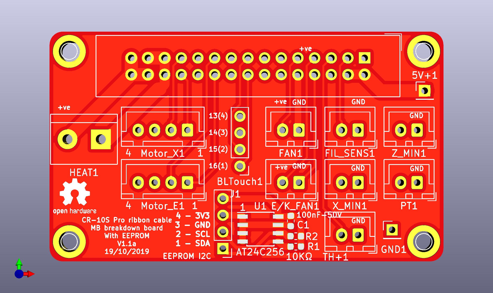
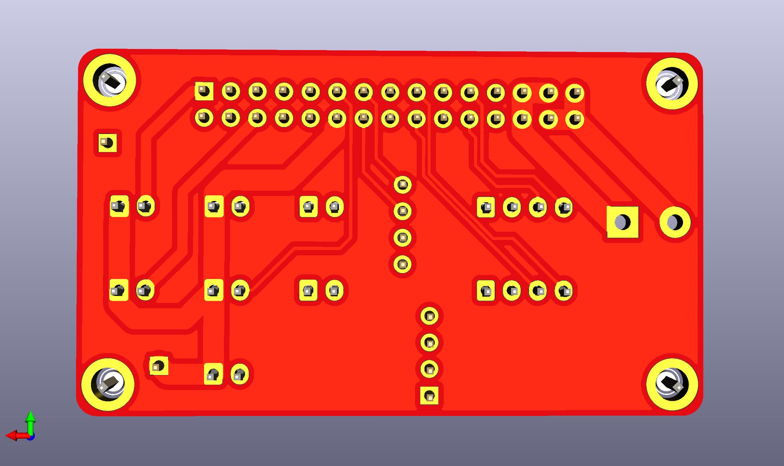

# Ribbon cable breakdown board
It is fully compatible with [original transfer board](https://www.aliexpress.com/item/33040303019.html), helps with wiring with non-original motherboards.

===============NOT YET TESTED!

changes from fork
- Beefed up trace width where possible. 
- Heater PCB trace has trace on both Front and Back.
- Heater connector changed to  a more standard 5.08mm screw terminal
- and added I2C AT24C256 EEPROM 

