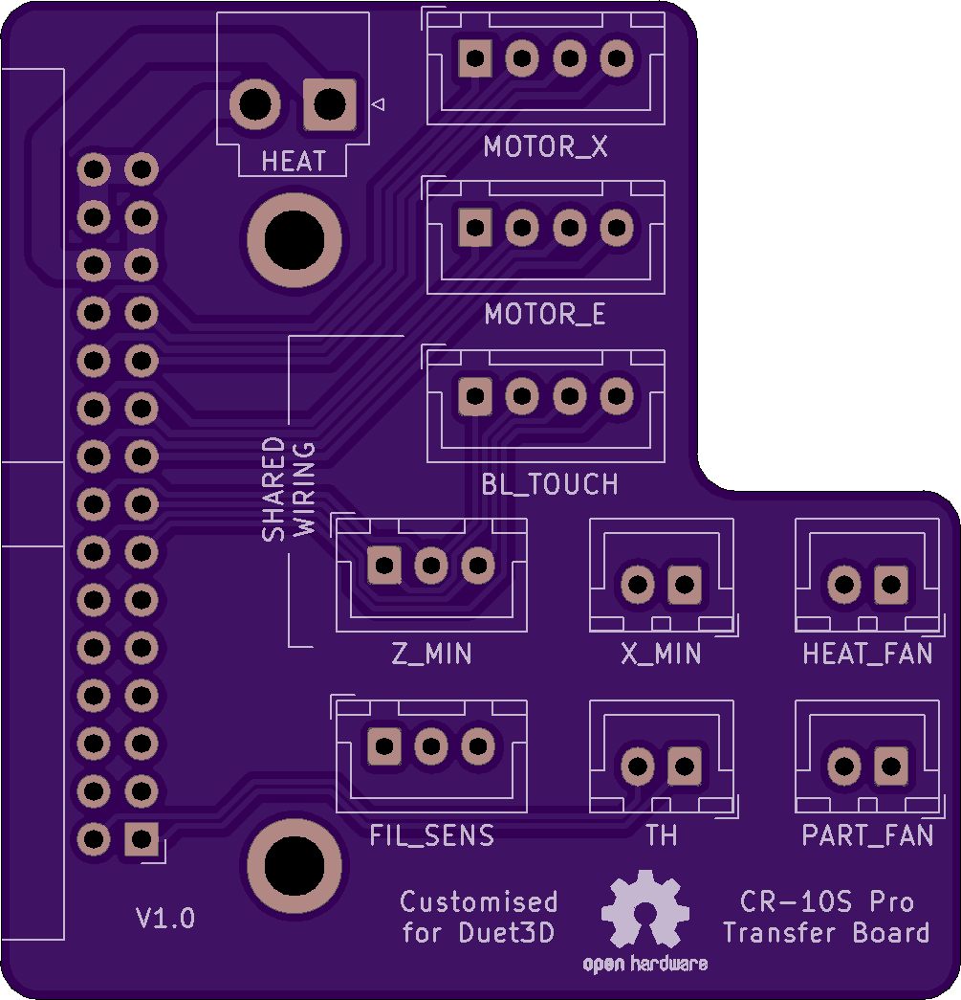
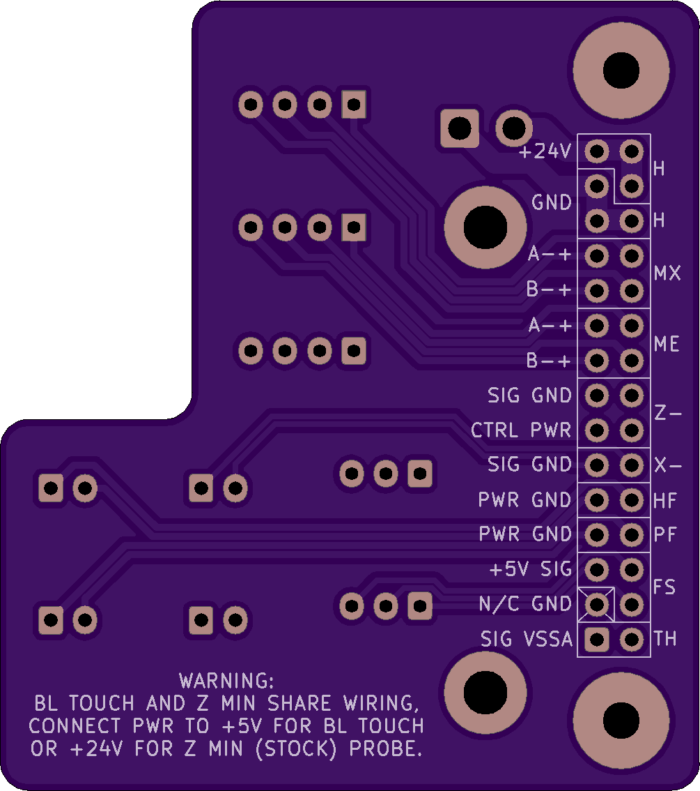

# CR-10S Pro Custom Transfer Board
Customized [transfer board](Transfer_Board/) to allow maximum installation flexibility when using Duet3D control boards.  Note that this modified version **is NOT** compatible with [ribbon cable breakdown board (pt)](../RibbonCable_MB_BreakdownBoard_pt/), since several ribbon cable conductors have been relocated or re-purposed in order to separate all the signal and power lines.

